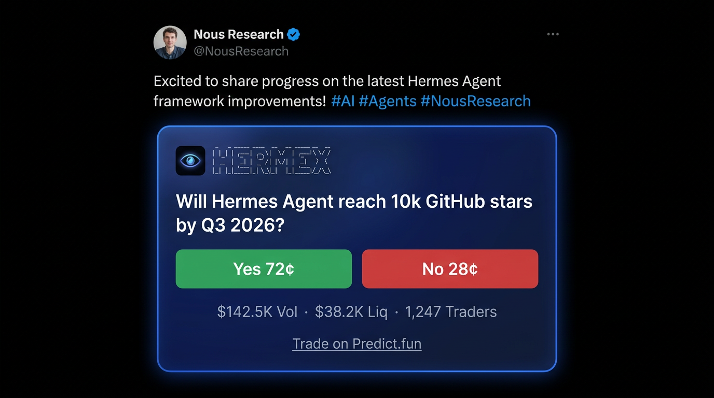
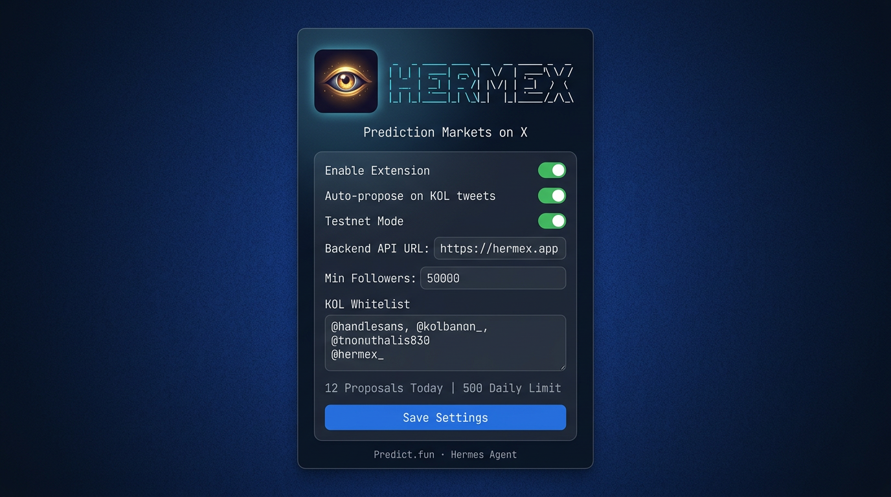

<p align="center">
  
</p>

<h1 align="center">
<pre>
╦ ╦ ╔═╗ ╦═╗ ╔╦╗ ╔═╗ ═╗ ╦
╠═╣ ║╣  ╠╦╝ ║║║ ║╣  ╔╩╦╝
╩ ╩ ╚═╝ ╩╚═ ╩ ╩ ╚═╝ ╩ ╚═
</pre>
</h1>

<p align="center">
  <b>Real-time prediction markets on X — powered by Hermes Agent</b>
</p>

<p align="center">
  <a href="https://x.com/herm3x"></a>
  <a href="https://predict.fun"></a>
  <a href="https://github.com/herm3x/hermes-agent/blob/main/LICENSE"></a>
  <a href="https://nousresearch.com"></a>
</p>

---

**Hermex** turns every KOL tweet into a tradeable prediction market. A Chrome Extension watches your X feed in real-time, and when it spots a tweet from an influential account, the **Hermes Agent** generates a market proposal in under 3 seconds — complete with smart probabilities, resolution criteria, and simulated order book data. Everything appears inline, right below the tweet.

> *Browse X. See a tweet. See the market. Trade it.*

---

## Preview

<table>
<tr>
<td width="60%">

### Inline Prediction Card

Every KOL tweet gets a prediction market card injected directly into the X feed — with Yes/No pricing, volume, liquidity, and a direct link to trade on Predict.fun.

</td>
<td width="40%">

### Extension Popup

Configure your KOL whitelist, backend URL, and monitor daily proposal stats — all from the extension popup.

</td>
</tr>
<tr>
<td>



</td>
<td>



</td>
</tr>
</table>

---

## How It Works

```
  Tweet detected          Hermes Agent           Card injected
  ┌──────────┐    ───►    ┌──────────┐    ───►   ┌──────────┐
  │ @elonmusk│            │ Analyze  │            │ Yes 72¢  │
  │ "Doge to │            │ Generate │            │ No  28¢  │
  │  the moon│            │ Price    │            │ $142K Vol│
  │  🚀"     │            │ Resolve  │            │ Trade ►  │
  └──────────┘            └──────────┘            └──────────┘
       DOM                    LLM                   Inline UI
   MutationObserver      Hermes 3 405B          Below the tweet
```

1. **Browse X normally** with the Hermex extension installed
2. `MutationObserver` detects KOL tweets in real-time — zero polling
3. **Hermes Agent** (LLM) analyzes the tweet as a quantitative analyst
4. A prediction card appears below the tweet with **Yes/No outcomes**, smart probabilities, volume, and liquidity
5. One click to **trade on [Predict.fun](https://predict.fun)**

---

## Features

| Feature | Description |
|---------|-------------|
| **Real-time detection** | MutationObserver watches the X feed — no polling, instant detection |
| **Smart probabilities** | Hermes Agent generates context-aware odds as a quantitative analyst |
| **KOL-aware pricing** | Market simulation with volume/liquidity scaled to author influence tier |
| **Predict.fun integration** | Matches existing markets or deep-links to create new ones |
| **Resilient extension** | Auto-reconnects on context invalidation, survives SPA navigation |
| **Live dashboard** | System monitor with CPU, memory, request stats, and LLM token usage |
| **Testnet-first** | Safe testing with Predict.fun testnet before going live |

---

## Architecture

```
┌──────────────────────────────────────────────────────┐
│  Chrome Extension (Manifest V3)                      │
│  ├── Content Script — DOM observer + card injection  │
│  ├── Background SW — API relay + config management   │
│  └── Popup — Settings, KOL whitelist, stats          │
└───────────────┬──────────────────────────────────────┘
                │ REST API
┌───────────────▼──────────────────────────────────────┐
│  Backend (Express + TypeScript + Bun)                │
│  ├── POST /api/proposal  — LLM market generation    │
│  ├── GET  /api/markets   — Predict.fun lookup        │
│  ├── GET  /api/system    — Live system monitor       │
│  └── GET  /api/health    — Health check              │
└───────┬──────────────────────┬───────────────────────┘
        │                      │
┌───────▼────────┐    ┌────────▼────────┐
│  Hermes Agent  │    │  Predict.fun    │
│  Hermes 3 405B │    │  REST API       │
│  via OpenRouter│    │  Testnet / Main │
└────────────────┘    └─────────────────┘
```

---

## Quick Start

### Prerequisites

- [Bun](https://bun.sh) (v1.0+)
- Chrome / Chromium browser
- [OpenRouter API key](https://openrouter.ai)

### 1. Clone

```bash
git clone https://github.com/herm3x/hermes-agent.git
cd hermes-agent/hermex
```

### 2. Backend

```bash
cd backend
cp .env.example .env
# Edit .env — add your OPENROUTER_API_KEY
bun install
bun run dev
```

Backend starts at `http://localhost:6088`

### 3. Chrome Extension

```bash
cd chrome-extension
bun install
bun run build
```

Load the extension:

1. Open `chrome://extensions`
2. Enable **Developer mode** (top right toggle)
3. Click **Load unpacked** → select `chrome-extension/dist`
4. Pin the ☤ Hermex icon in your toolbar

### 4. Configure

Click the Hermex icon to configure:

| Setting | Default | Description |
|---------|---------|-------------|
| Backend API URL | `http://localhost:6088` | Your backend endpoint |
| Testnet Mode | On | Use Predict.fun testnet |
| Auto-propose | On | Auto-generate for KOL tweets |
| Min Followers | 50,000 | Follower threshold |
| KOL Whitelist | — | Custom handles to always track |

---

## Deploy to VPS (Docker)

```bash
cd hermex

# Configure
cd backend && cp .env.example .env
# Edit .env with your OPENROUTER_API_KEY

# Build & run
cd ..
docker compose up -d

# Check health
curl http://your-server:6088/api/health
```

Update the **Backend API URL** in the extension popup to your server's public URL.

---

## Supported KOLs

Hermex ships with a default list of 40+ tracked KOLs including:

`@elonmusk` `@VitalikButerin` `@cz_binance` `@realDonaldTrump` `@sama` `@NousResearch` `@OpenAI` `@AnthropicAI` `@GoogleDeepMind` `@APompliano` `@CathieDWood` `@saylor` and more...

Add any handle to your **KOL Whitelist** to track custom accounts.

---

## Tech Stack

| Layer | Technology |
|-------|-----------|
| Extension | TypeScript, Webpack, Manifest V3 |
| Backend | Bun, Express, TypeScript |
| LLM | Hermes 3 (405B) via OpenRouter |
| Markets | Predict.fun REST API |
| Deploy | Docker, docker-compose |
| Design | Royal Blue glassmorphism, JetBrains Mono |

---

## Project Structure

```
hermex/
├── backend/
│   ├── src/
│   │   ├── server.ts              # Express server entry
│   │   ├── config.ts              # Environment config
│   │   ├── routes/proposal.ts     # API routes + market simulation
│   │   └── services/
│   │       ├── hermes.ts          # LLM prompt engineering
│   │       ├── predict-fun.ts     # Predict.fun API client
│   │       ├── system-monitor.ts  # Live system stats
│   │       └── logger.ts          # Request logger
│   └── .env.example
├── chrome-extension/
│   ├── src/
│   │   ├── content/               # Tweet detection + card injection
│   │   ├── background/            # Service worker (API relay)
│   │   ├── popup/                 # Extension popup UI
│   │   └── types/                 # Shared TypeScript interfaces
│   ├── public/                    # manifest.json + popup.html
│   └── assets/                    # Eye logo + icons
├── Dockerfile
├── docker-compose.yml
└── README.md
```

---

## Roadmap

- [x] Chrome Extension with real-time KOL detection
- [x] Hermes Agent LLM integration (smart probabilities)
- [x] Predict.fun testnet integration
- [x] Dashboard with live system monitoring
- [x] Docker deployment
- [ ] Trade on Predict.fun deep linking (specific market pages)
- [ ] Hot Tweet Markets sidebar (Top 5 proposals)
- [ ] Hermes self-learning loop (improve from market outcomes)
- [ ] Mainnet support
- [ ] Telegram / Discord sync push
- [ ] KOL subscription feed

---

<p align="center">
  <b>Follow us on <a href="https://x.com/herm3x">𝕏 @herm3x</a></b>
</p>

<p align="center">
  Built with <a href="https://nousresearch.com">Hermes Agent</a> + <a href="https://predict.fun">Predict.fun</a>
</p>

<p align="center">
  MIT License
</p>
